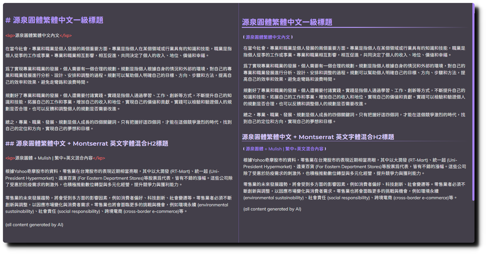
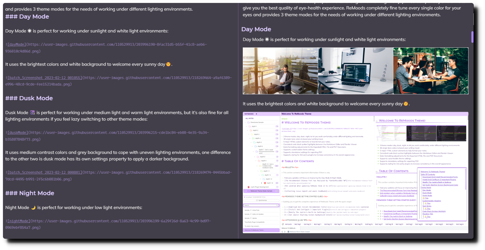
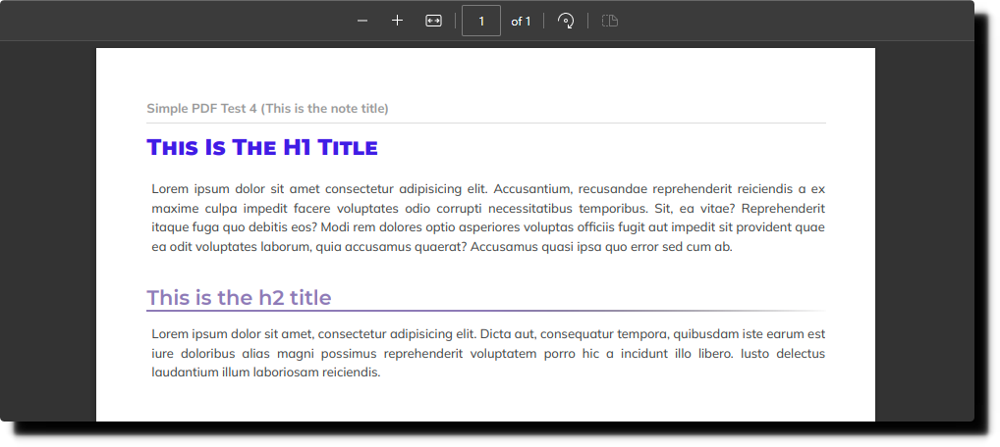

# ReMoods Theme Settings Introduction

ReMoods Theme provides you with a deep customization experience for the notes and Joplin’s interface. This document shows the preview and explanations of the settings properties’ effects.

## Page Navigation

| [Home](https://github.com/Sinacs/Joplin.Plugin.ReMoods.Theme#remoods-theme) | [Getting Started Guide](https://github.com/Sinacs/Joplin.Plugin.ReMoods.Theme/blob/master/Doc-GettingStartedGuide.md#remoods-theme-getting-started-guide) | [Settings Introduction](https://github.com/Sinacs/Joplin.Plugin.ReMoods.Theme/blob/master/Doc-SettingsIntroduction.md) |

## Table Of Contents

- [Basic Settings](#basic-settings)
  - [ReMoods Hue](#remoods-hue)
  - [Theme Mode](#theme-mode)
  - [Font](#font)
  - [Font Size](#font-size)
- [Note Element Settings](#note-element-settings)
  - [Enable darker background color (Dusk Mode Only)](#enable-darker-background-color-dusk-mode-only)
  - [Enable capitalize the first letter of each word on H1 heading](#enable-capitalize-the-first-letter-of-each-word-on-h1-heading)
  - [Enable small-caps effect on H1 heading](#enable-small-caps-effect-on-h1-heading)
  - [Enable emphasize colors for insert text \& strikethrough text](#enable-emphasize-colors-for-insert-text--strikethrough-text)
  - [Enable background colors for insert text \& strikethrough text](#enable-background-colors-for-insert-text--strikethrough-text)
  - [Enable theme color for list text](#enable-theme-color-for-list-text)
  - [Enable evident horizontal rule](#enable-evident-horizontal-rule)
  - [Enable border (H1 ~ H6)](#enable-border-h1--h6)
  - [Enable heading marker](#enable-heading-marker)
  - [Enable twill pattern for H1 heading](#enable-twill-pattern-for-h1-heading)
  - [Enable twill pattern for horizontal rule](#enable-twill-pattern-for-horizontal-rule)
  - [Enable &#34;Justify&#34; effect](#enable-justify-effect)
  - [Enable dotted border](#enable-dotted-border)
  - [Enable math notation aligned-left](#enable-math-notation-aligned-left)
  - [Enable Eye-Protector effect](#enable-eye-protector-effect)
  - [Enable Max-height limit](#enable-max-height-limit)
  - [Enable symbols](#enable-symbols)
- [UI Settings](#ui-settings)
  - [Enable wider scrollbar](#enable-wider-scrollbar)
  - [Enable multiple lines notebook name](#enable-multiple-lines-notebook-name)
  - [Enable horizontal scrollbar for the notebook name](#enable-horizontal-scrollbar-for-the-notebook-name)
  - [Enable notebook folder icon](#enable-notebook-folder-icon)
  - [Enable &#34;All Notes&#34; button](#enable-all-notes-button)
  - [Enable sync feature panel](#enable-sync-feature-panel)
  - [Enable tag feature panel](#enable-tag-feature-panel)
  - [Enable auto-scroll effect for note list items](#enable-auto-scroll-effect-for-note-list-items)
- [Print \& Export PDF (Advanced Settings)](#print--export-pdf-advanced-settings)
  - [Display note title](#display-note-title)
  - [Display h1 border](#display-h1-border)
  - [Display link href](#display-link-href)
  - [Display abbreviation description](#display-abbreviation-description)
  - [Other display elements](#other-display-elements)

## Basic Settings

Below are the basic settings for the entire theme:

[⬆️Back](#table-of-contents)

### ReMoods Hue

The theme color settings use the [HSL model](https://www.w3schools.com/colors/colors_hsl.asp). You can edit the color `H` value with the ReMoods Hue property to change the color tone. Each option has a 10-degree difference. See below for reference:

[⬆️Back](#table-of-contents)

### Theme Mode

ReMoods offers 3 theme modes for different lighting environments. Choose your favorite one and remember to switch the Joplin built-in theme accordingly. Here will not provides the preview of them but you can have a preview on [the theme mode introduction](https://github.com/Sinacs/Joplin.Plugin.ReMoods.Theme#theme-mode).

[⬆️Back](#table-of-contents)

### Font

Font settings are divided into two separate parts:

- `Screen`: This affects all the text within Joplin notes.
- `Print`: This affects all the text when you print or export Joplin notes to PDF.

Below are the font settings properties:

| Property                 | Area                                | Description                                                                 |
| ------------------------ | ----------------------------------- | --------------------------------------------------------------------------- |
| `Base Font`            | Markdown Editor  Render Viewer | This affects all the text.                                                  |
| `Monospace Font`       | Markdown Editor  Render Viewer | This affects only inline code, code block, and most of the markdown syntax. |
| `Heading Font`         | Markdown Editor  Render Viewer | This affects only headings.                                                 |
| `Print Base Font`      | Print & Export PDF                  | This affects all the text.                                                  |
| `Print Monospace Font` | Print & Export PDF                  | This affects only inline code and code block.                               |
| `Print Heading Font`   | Print & Export PDF                  | This affects only headings.                                                 |

To change the font settings, you can either:

1. Enter the name of your preferred font in double quotes: `"font name"`
2. Or, if you need multiple fonts for different languages, enter the font names in order of priority from left to right, separated by commas: `"font 1", "font 2", "font 3"`

Based on you have installed the recommended fonts of ReMoods, the below shows how the fonts looks like under the default font settings:

In English:

In Traditional Chinese:

In Simplified Chinese:

[⬆️Back](#table-of-contents)

### Font Size

| Property                                  | Area                                  | Description                                                                                   | Unit          | Size calculates based on...   |
| ----------------------------------------- | ------------------------------------- | --------------------------------------------------------------------------------------------- | ------------- | ----------------------------- |
| `Base Font Size`                        | Markdown Editor  Render Viewer   | Affects the base size for all the text.                                                       | pixel(px)     | -                             |
| `Monospace Font Size`                   | Markdown Editor  Render Viewer   | Affects the base size for only inline code, code block, and most of the markdown syntax. | pixel(px)     | -                             |
| `H1 Font Size`                          | Markdown Editor  Render Viewer   | Affects H1 heading.                                                                           | percentage(%) | `Base Font Size`            |
| `H2 Font Size`                          | Markdown Editor  Render Viewer   | Affects H2 heading.                                                                           | percentage(%) | `Base Font Size`            |
| `H3 Font Size`                          | Markdown Editor  Render Viewer   | Affects H3 heading.                                                                           | percentage(%) | `Base Font Size`            |
| `H4 Font Size`                          | Markdown Editor  Render Viewer   | Affects H4 heading.                                                                           | percentage(%) | `Base Font Size`            |
| `H5 Font Size`                          | Markdown Editor  Render Viewer   | Affects H5 heading.                                                                           | percentage(%) | `Base Font Size`            |
| `H6 Font Size`                          | Markdown Editor  Render Viewer   | Affects H6 heading.                                                                           | percentage(%) | `Base Font Size`            |
| `Print Base Font Size`                  | Print & Export PDF                    | Affects the base size for all the text.                                                       | pixel(px)     | -                             |
| `Print Monospace Font Size`             | Print & Export PDF                    | Affects the base size for only inline code, code block.                                       | pixel(px)     | -                             |
| `Print H1 Font Size`                    | Print & Export PDF                    | Affects H1 heading.                                                                           | percentage(%) | `Print Base Font Size`      |
| `Print H2 Font Size`                    | Print & Export PDF                    | Affects H2 heading.                                                                           | percentage(%) | `Print Base Font Size`      |
| `Print H3 Font Size`                    | Print & Export PDF                    | Affects H3 heading.                                                                           | percentage(%) | `Print Base Font Size`      |
| `Print H4 Font Size`                    | Print & Export PDF                    | Affects H4 heading.                                                                           | percentage(%) | `Print Base Font Size`      |
| `Print H5 Font Size`                    | Print & Export PDF                    | Affects H5 heading.                                                                           | percentage(%) | `Print Base Font Size`      |
| `Print H6 Font Size`                    | Print & Export PDF                    | Affects H6 heading.                                                                           | percentage(%) | `Print Base Font Size`      |
| `Math Notation Font Size`               | Render Viewer Print & Export PDF | Affects only the math notation.                                                               | pixel(px)     | -                             |
| `Enable smaller code block text`        | Markdown Editor Render Viewer    | Shrink by 2 pixels.                                                                           | -             | `Base Font Size`            |
| `Enable smaller markdown table syntax`  | Markdown Editor                       | Shrink by 2 pixels.                                                                           | -             | `Monospace Font Size`       |
| `Enable smaller non-essential contents` | Markdown Editor                       | Shrink by 2 pixels.                                                                           | -             | `Monospace Font Size`       |
| `Enable smaller code block text(pdf)`   | Print & Export PDF                    | Shrink by 2 pixels.                                                                           | -             | `Print Monospace Font Size` |

To change the font settings, you need to pay attention to the units and then enter only a number.

[⬆️Back](#table-of-contents)

## Note Element Settings

Below are the settings for the notes content elements:

### Enable darker background color (Dusk Mode Only)

| Property                                            | Area                                |
| --------------------------------------------------- | ----------------------------------- |
| `Enable darker background color (Dusk Mode Only)` | Markdown Editor  Render Viewer |

This applies a darker background color for the Dusk Mode, which gives a feeling of being between Dusk Mode and Night Mode.

Enable:

Disable:

[⬆️Back](#table-of-contents)

### Enable capitalize the first letter of each word on H1 heading

| Property                                                          | Area                                |
| ----------------------------------------------------------------- | ----------------------------------- |
| `Enable capitalize the first letter of each word on H1 heading` | Markdown Editor  Render Viewer |

Enable:

Disable:

[⬆️Back](#table-of-contents)

### Enable small-caps effect on H1 heading

| Property                                   | Area                                |
| ------------------------------------------ | ----------------------------------- |
| `Enable small-caps effect on H1 heading` | Markdown Editor  Render Viewer |

Enable:

Disable:

[⬆️Back](#table-of-contents)

### Enable emphasize colors for insert text & strikethrough text

| Property                                                        | Area                                |
| --------------------------------------------------------------- | ----------------------------------- |
| `Enable emphasize color for insert text & strikethrough text` | Markdown Editor  Render Viewer |

Enable:

Disable:

[⬆️Back](#table-of-contents)

### Enable background colors for insert text & strikethrough text

| Property                                                         | Area                                |
| ---------------------------------------------------------------- | ----------------------------------- |
| `Enable background color for insert text & strikethrough text` | Markdown Editor  Render Viewer |

The effect of this setting is depends on the `Enable emphasize colors for insert text & strikethrough text` setting is enabled or not.

1. When `Enable emphasize color for insert text & strikethrough text` is enabled;
   Then, if `Enable background color for insert text & strikethrough text` is:

Enable:

Disable:

2. When `Enable emphasize color for insert text & strikethrough text` is disabled;
   Then, if `Enable background color for insert text & strikethrough text` is:

Enable:

Disable:

[⬆️Back](#table-of-contents)

### Enable theme color for list text

| Property                             | Area                                |
| ------------------------------------ | ----------------------------------- |
| `Enable theme color for list text` | Markdown Editor  Render Viewer |

Enable:

Disable:

[⬆️Back](#table-of-contents)

### Enable evident horizontal rule

| Property                           | Area            |
| ---------------------------------- | --------------- |
| `Enable evident horizontal rule` | Markdown Editor |

Enable:

Disable:

[⬆️Back](#table-of-contents)

### Enable border (H1 ~ H6)

| Property             | Area          |
| -------------------- | ------------- |
| `Enable H1 border` | Render Viewer |
| `Enable H2 border` | Render Viewer |
| `Enable H3 border` | Render Viewer |
| `Enable H4 border` | Render Viewer |
| `Enable H5 border` | Render Viewer |
| `Enable H6 border` | Render Viewer |

Enable:

Disable:

[⬆️Back](#table-of-contents)

### Enable heading marker

| Property                  | Area          |
| ------------------------- | ------------- |
| `Enable heading marker` | Render Viewer |

Enable:

Disable:

[⬆️Back](#table-of-contents)

### Enable twill pattern for H1 heading

| Property                                | Area                                   |
| --------------------------------------- | -------------------------------------- |
| `Enable twill pattern for H1 heading` | Render Viewer  Print & Export PDF |

Enable:

Disable:

[⬆️Back](#table-of-contents)

### Enable twill pattern for horizontal rule

| Property                                     | Area                                   |
| -------------------------------------------- | -------------------------------------- |
| `Enable twill pattern for horizontal rule` | Render Viewer  Print & Export PDF |

Enable:

Disable:

[⬆️Back](#table-of-contents)

### Enable "Justify" effect

The below 4 settings are just center the text of specific elements:

| Property                                         | Area                                   |
| ------------------------------------------------ | -------------------------------------- |
| `Enable "Justify" effect for paragraph text`   | Render Viewer  Print & Export PDF |
| `Enable "Justify" effect for list text`        | Render Viewer  Print & Export PDF |
| `Enable "Justify" effect for checklist`        | Render Viewer  Print & Export PDF |
| `Enable "Justify" effect for Stick Notes text` | Render Viewer  Print & Export PDF |

[⬆️Back](#table-of-contents)

### Enable dotted border

| Property                                | Area          |
| --------------------------------------- | ------------- |
| `Enable dotted border for blockquote` | Render Viewer |
| `Enable dotted border for code block` | Render Viewer |

Enable:

Disable:

[⬆️Back](#table-of-contents)

### Enable math notation aligned-left

| Property                              | Area                                   |
| ------------------------------------- | -------------------------------------- |
| `Enable math notation aligned-left` | Render Viewer  Print & Export PDF |

Enable:

Disable:

[⬆️Back](#table-of-contents)

### Enable Eye-Protector effect

| Property                                           | Area          |
| -------------------------------------------------- | ------------- |
| `Enable Eye-Protector effect for mermaid chart`  | Render Viewer |
| `Enable Eye-Protector effect for attached image` | Render Viewer |

Enable:

(Dusk Mode)

(Night Mode)

Disable:

(Dusk Mode)

(Night Mode)

[⬆️Back](#table-of-contents)

### Enable Max-height limit

| Property                                    | Area          |
| ------------------------------------------- | ------------- |
| `Enable max height limit for code block`  | Render Viewer |
| `Enable max height limit for art gallery` | Render Viewer |

Enable:

Disable:

[⬆️Back](#table-of-contents)

### Enable symbols

| Property                                                                                      | Area          |
| --------------------------------------------------------------------------------------------- | ------------- |
| `Enable the "++" & "--" symbols at the beginning of the insert text and strikethrough text` | Render Viewer |
| `Enable the ">\|" symbol at the beginning of the inline code`                                | Render Viewer |
| `Enable the symbol at the beginning of the custom title block`                              | Render Viewer |

Enable:

- Insert Text & Strikethrough Text Symbol
  
- Inline Code Symbol
  
- Custom Title Block Symbol
  

Disable:

- Insert Text & Strikethrough Text Symbol
  
- Inline Code Symbol
  
- Custom Title Block Symbol
  

[⬆️Back](#table-of-contents)

## UI Settings

Below are the settings properties for UI elements:

[⬆️Back](#table-of-contents)

### Enable wider scrollbar

| Property                   | Area                                 |
| -------------------------- | ------------------------------------ |
| `Enable wider scrollbar` | Notebook Panel  Note List Panel |

This effect only appears when mouse hovers over the notebook panel or note list panel.

Enable:

Disable:

[⬆️Back](#table-of-contents)

### Enable multiple lines notebook name

| Property                                | Area           |
| --------------------------------------- | -------------- |
| `Enable multiple lines notebook name` | Notebook Panel |

See the difference in the dept-7 and depth-10 directory.

Enable:

Disable:

[⬆️Back](#table-of-contents)

### Enable horizontal scrollbar for the notebook name

| Property                                              | Area           |
| ----------------------------------------------------- | -------------- |
| `Enable horizontal scrollbar for the notebook name` | Notebook Panel |

The horizontal scrollbar will become thick when mouse hovering over the notebook name but the effect is not included in the below preview.

See the difference in the depth-7 directory.

Enable:

Disable:

[⬆️Back](#table-of-contents)

### Enable notebook folder icon

| Property                        | Area           |
| ------------------------------- | -------------- |
| `Enable notebook folder icon` | Notebook Panel |

Enable:

Disable:

[⬆️Back](#table-of-contents)

### Enable "All Notes" button

| Property                      | Area           |
| ----------------------------- | -------------- |
| `Enable "All Notes" button` | Notebook Panel |

Enable:

Disable:

[⬆️Back](#table-of-contents)

### Enable sync feature panel

| Property                      | Area           |
| ----------------------------- | -------------- |
| `Enable sync feature panel` | Notebook Panel |

See the difference from the sync details and sync button which at the bottom of the notebook panel.

Enable:

Disable:

[⬆️Back](#table-of-contents)

### Enable tag feature panel

| Property                     | Area                              |
| ---------------------------- | --------------------------------- |
| `Enable tag feature panel` | Notebook Panel  Editor Panel |

See the difference from the tags section of notebook panel and the tag bar of editor panel.

Enable:

Disable:

[⬆️Back](#table-of-contents)

### Enable auto-scroll effect for note list items

| Property                                          | Area            |
| ------------------------------------------------- | --------------- |
| `Enable auto-scroll effect for note list items` | Note List Panel |

If this is enabled, the notes name will auto-scroll from right to left when your mouse hovers over it a while.

[⬆️Back](#table-of-contents)

## Print & Export PDF (Advanced Settings)

Below are the settings for print & export PDF:

[⬆️Back](#table-of-contents)

### Display note title

| Property               | Area               |
| ---------------------- | ------------------ |
| `Display note title` | Print & Export PDF |

In editor:

Enable, pdf output:

Disable, pdf output:

[⬆️Back](#table-of-contents)

### Display H1 border

| Property              | Area               |
| --------------------- | ------------------ |
| `Display H1 border` | Print & Export PDF |

When the PDF is showing the note title, h1, and h2 at the same time, you might find that they are all having a border. So, in some similar situation, you might want to disable the H1 border.

In editor:

Enable:

Disable:

[⬆️Back](#table-of-contents)

### Display link href

| Property              | Area               |
| --------------------- | ------------------ |
| `Display link href` | Print & Export PDF |

When anchor link is mean nothing on a paper, this setting allows you to display the link href on the PDF, but it only works when your markdown link syntax is included the "title" attribute. e.g. `[Joplin](https://www.joplin.org "Joplin")`

In editor:

Enable, pdf output:

Disable, pdf output:

[⬆️Back](#table-of-contents)

### Display abbreviation description

| Property                             | Area               |
| ------------------------------------ | ------------------ |
| `Display abbreviation description` | Print & Export PDF |

When the tooltip of abbreviation text is mean nothing on a paper, this setting allows you to display the abbreviation description on the PDF.

In editor:

Enable, pdf output:

Disable, pdf output:

[⬆️Back](#table-of-contents)

### Other display elements

The below elements might be not a must to show in the notes, so you can just hide them based on your needs, but here will not provides the preview of them.

| Property                                | Area               |
| --------------------------------------- | ------------------ |
| `Display heading marker`              | Print & Export PDF |
| `Display table of contents`           | Print & Export PDF |
| `Display Sticky Notes`                | Print & Export PDF |
| `Display Key Mention`                 | Print & Export PDF |
| `Display Key Mention of Sticky Notes` | Print & Export PDF |
| `Display the text of Spoiler Inline`  | Print & Export PDF |
