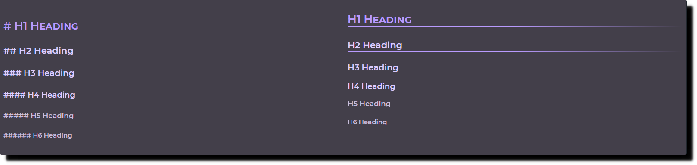
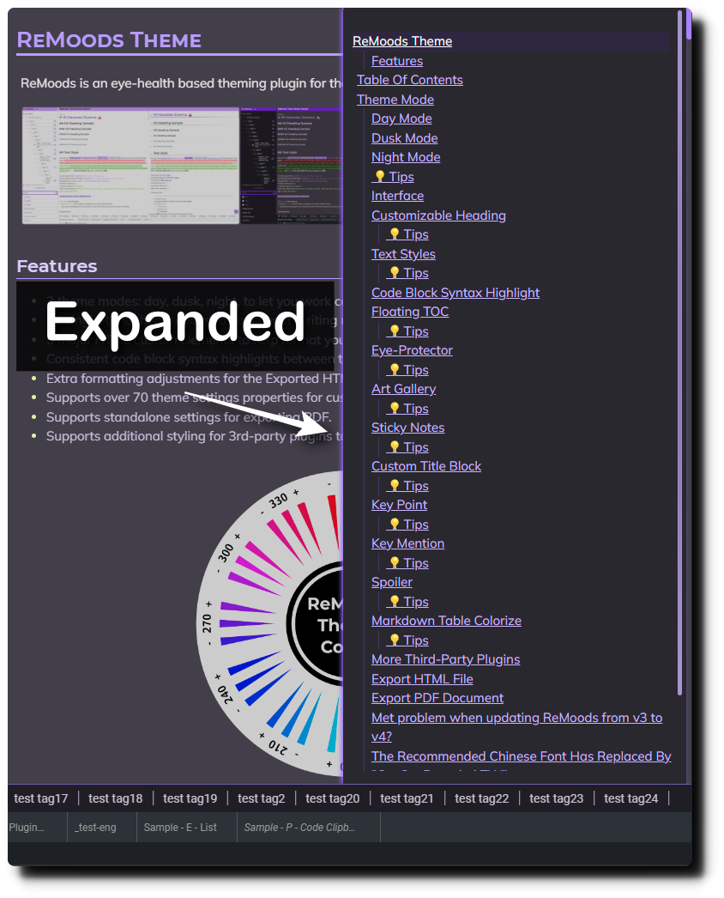

# ReMoods Theme

ReMoods is an eye-health based theming plugin for the open source note-taking app Joplin.


## Features

- 3 theme modes: day, dusk, night, to let you work comfortably under different lighting environments.
- 36 single-tone theme colors to boost your writing mood.
- 5 major HTML custom elements to help format your notes.
- Consistent code block syntax highlights between the Markdown Editor and Render Viewer.
- Extra formatting adjustments for the Exported HTML File and PDF Document.
- Supports over 70 theme settings properties for customizing the theme.
- Supports standalone settings for exporting PDF.
- Supports additional styling for 3rd-party plugins to increase consistency in the overall appearance.


# Table Of Contents

**BULLETIN:**

> This section contains important information if there is any.

- [Is &#34;Chiron Hei HK&#34; Still Works In ReMoods?](https://github.com/Sinacs/Joplin.Plugin.ReMoods.Theme/discussions/38)
- [Met problem when updating ReMoods from v3 to v4?](https://github.com/Sinacs/Joplin.Plugin.ReMoods.Theme/discussions/37)
- [Help Reporting Issues](https://github.com/Sinacs/Joplin.Plugin.ReMoods.Theme/discussions/39)

**DOCUMENTATION:**

> Information for new users.

- [ReMoods Theme Getting Started Guide](Doc-GettingStartedGuide.md)
- [Settings Introduction](Doc-SettingsIntroduction.md)

**APPEARANCE & USE TIPS:**

> An overview for the general appearance and use tips.

- [Theme Mode](#theme-mode)
- [Interface](#interface)
- [Customizable Heading](#customizable-heading)
- [Text Styles](#text-styles)
- [Code Block Syntax Highlight](#code-block-syntax-highlight)
- [Floating TOC](#floating-toc)
- [Eye-Protector](#eye-protector)

**CUSTOM ELEMENTS & USE TIPS:**

> Details about the 5 major custom elements of ReMoods Theme. If you feel comfortable taking notes with a bit HTML, these custom elements are the best helper for formatting your notes!

- [Art Gallery](#art-gallery)
- [Sticky Notes](#sticky-notes)
- [Custom Title Block](#custom-title-block)
- [Key Point](#key-point)
- [Key Mention](#key-mention)

<!-- - [Simplify ReMoods Custom Elements CSS Template](#simplify-remoods-custom-elements-css-template) -->

**THIRD-PARTY PLUGINS STYLING:**

> Details about the third-party plugins styling. While the styling is mainly to increase consistency in the overall appearance, some of them might have extra usage in ReMoods!

- [Spoiler](#spoiler)
- [Markdown Table Colorize](#markdown-table-colorize)
- [More Third-Party Plugins](#more-third-party-plugins)

**PRINT & EXPORT:**

> Details about converting notes to PDF and HTML files!

- [Export HTML File](#export-html-file) (soon...)
- [Export PDF Document](#export-pdf-document)

# Theme Mode

ReMoods is most concerned about people who take long-time working with Joplin screen per day and aims to give you the best quality of eye-health experience. ReMoods completely fine tune every single color for your eyes and provides 3 theme modes for the needs of working under different lighting environments.

### Day Mode

Day Mode ☀️ is perfect for working under sunlight and white light environments:


It uses the brightest colors and white background to welcome every sunny day🌞.


[⬆️Back](#table-of-contents)

### Dusk Mode

Dusk Mode 🌆 is perfect for working under medium light and warm light environments, but it’s also fine for all lighting environments if you feel lazy switching to other theme modes:


It uses medium contrast colors and grey background to cope with uneven lighting environments, one difference to the other two is dusk mode has its own settings property to apply a darker background.


[⬆️Back](#table-of-contents)

### Night Mode

Night Mode 🌙 is perfect for working under low light environments:


It uses low-contrast colors and minimizes unwanted glare within Joplin to protect the eyes of a hardworking night owl🦉.


### 💡Tips

**Q: Why didn't other plugins' background color change with the Joplin's built-in theme?**

**A:** *It only works if those plugin color values are set to default. Set it back to the default value, and you will see it works.*

**Q: Can I only change the theme mode but not change the built-in theme?**

**A:** *Yes, you can, but you will find that other plugins' background colors might not match your ReMoods theme, and some of the text colors might become hard to read.*

[⬆️Back](#table-of-contents)

## Interface

Here shows you the core changing of the Joplin UI elements:


| No. | Object                 | Description                                                                                                                                                                                          |
| :-- | :--------------------- | :--------------------------------------------------------------------------------------------------------------------------------------------------------------------------------------------------- |
| 1   | Notebook panel header  | - Click the header to open/close the notebook list<br /> - Click the notebook icon to create a new notebook                                                                                          |
| 2   | Notebook list          | - The notebook title is set to multiple lines by default<br /> - If a single word is too long, it will come out a horizontal scrollbar<br /> - You can use `Shift + scroll` to move back and forth |
| 3   | Note list panel header | - In Joplin v2.10.12+, ReMoods keeps the new buttons small                                                                                                                                           |
| 4   | Editor panel header    | - The toolbar has hidden to get more space for the note content<br /> - Mouse hovering over the header, then you will see the toolbar appearing                                                      |
| 5   | Tag bar                | - You can create many tags without worrying about the container space<br /> - It can show unlimited tags<br /> - You can use `shift + scroll` to lookups your tags                                 |
| 6   | Plugin panel           | - ReMoods cannot modify any colors of the plugin panel<br /> - ReMoods has minimized the sense of incongruity when using the built-in light theme and dark theme                                     |

[⬆️Back](#table-of-contents)

## Customizable Heading

ReMoods supplies multiple settings properties that can help you customize the appearance of headings, making them more outstanding.




### 💡Tips

1. You can set your favorite font for headings to improve the personality style of your notes.
2. You can enable border for the headings which you often use with a border.
3. You can also add border to headings by typing `---` or `***` below the target heading, for which you didn't enable the border in options.
4. You can enable the heading's marker, and it will appear right before each heading.(Render Viewer Only)
5. You can enable the H1 twill pattern style to make it more outstanding, but this effect would also affect the emoji icons on H1, so it is required to use `span` to avoid the twill pattern affecting it.


[⬆️Back](#table-of-contents)

## Text Styles

Most of the text colors would change depends on the theme color you are using. Let's compare the difference after the theme color changed:


### 💡Tips

1. If you mostly use *Insert Text and Strikethrough Text* as the meanings of add & remove, you would feel comfortable with the red & green style.
2. If you mostly use *Insert Text* as underline text, it would be better to use the theme color style.(default)
3. You can use the HTML `span` tag below a list item and add description to it, and the `span` text would be present in a different color.
4. More other text settings can be discovered in the options.

[⬆️Back](#table-of-contents)

## Code Block Syntax Highlight

Here show you the syntax highlighting styles:


It would change with the theme color too:


[⬆️Back](#table-of-contents)

## Floating TOC

Joplin provides a great built-in Markdown TOC feature which helps you create the TOC by typing a simple command `[[toc]]` within your notes. ReMoods has restyled the TOC and made it float at the bottom right of the Render Viewer.




### 💡Tips

1. The TOC floating button will only appear after you type the `[[toc]]` command within your notes.
2. Mouse hover over the floating button to open it.
3. You can hide the floating button by disabling the `Enable Markdown TOC floating button` in options.

[⬆️Back](#table-of-contents)

## Eye-Protector

Eye-Protector is only available for `Dusk Mode` and `Night Mode`, it will automatically reduce the brightness for all attached images and mermaid charts within your notes to avoid bright light flashing your eyes while scrolling up and down in your notes.


| Theme Mode | Reduce Brightness | Mouse Hover Effect                           |
| ---------- | ----------------- | -------------------------------------------- |
| Day Mode   | Not available     | Not available                                |
| Dusk Mode  | 20% Darker        | Return to original brightness in 1.2 seconds |
| Night Mode | 40% Darker        | Return to original brightness in 2.5 seconds |

### 💡Tips

1. You can disable it by going to `Tools` > `Options` > `ReMoods Theme` and disabling the `Enable Eye-Protector effect for mermaid charts` and `Enable Eye-Protector effect for images`.

[⬆️Back](#table-of-contents)

## Art Gallery

Art Gallery provides 11 custom elements for you to split attached images into multiple columns. It would be helpful if you have many images attached to your note.

Art Gallery has default limiting the `max-height` to 56% viewport height. Let's see how it works:

| Custom Elements | Force Columns |
| :-------------: | :-----------: |
|       ag2       |       2       |
|       ag3       |       3       |
|       ag4       |       4       |
|       ag5       |       5       |
|       ag6       |       6       |
|       ag7       |       7       |
|       ag8       |       8       |
|       ag9       |       9       |
|      ag10      |      10      |
|      ag11      |      11      |
|      ag12      |      12      |

Below is the sample of the art gallery(ag6) with 30 images:


### 💡Tips

1. The custom element name `ag` stands for *Art Gallery*.
2. The `ag` tag must use *below the plain text* .
3. *Do not include any blank line within the body*, blank line will break the format .

> Note: If you've followed the getting started guide and using the Quick HTML Tags plugin to create tags for custom elements, you should remind that the `<ag>` is not a complete custom element name. You should always add a number behind it manually, such as `<ag4>`, `<ag8>`, etc.

[⬆️Back](#table-of-contents)

## Sticky Notes

ReMoods has 8 custom elements for creating the Sticky Notes: `note` , `tip` , `question` , `explain` , `warning` , `comment`, `keyword` , `important`. They can help you build the article structure.

Let’s see what are the Sticky Notes for:


### 💡Tips

1. Add a blank line *at the top of the open tag*, otherwise it may cause a format problem.
2. Use  `<br>` for line break.
3. *Do not include any blank line within the Sticky Notes*, if you want to add a *blank line* please use  `<br><br>`.

[⬆️Back](#table-of-contents)

## Custom Title Block

Custom Title Block would be suitable for emphasizing a key concept, making it more outstanding from other content.

Let's see what it looks like:


### 💡Tips

1. The custom element name `ctb` stands for *Custom Title Block*.
2. Type your title *near the open tag* .
3. Keep your title *within one line*.
4. Start typing your content *in the second line*.
5. Use  `<br>` for line break.

> Please mention that *"within one line"* means it's *according to your panel width*.

[⬆️Back](#table-of-contents)

## Key Point

The custom element Key Point is super useful when you want to separate the content without using the Heading or Strong Text. It also can keep your mind clear from the sense of overly using the Strong Text or Heading.

3 best timing to use the Key Point:

1. To keep *multiple subtitles* stay within *one heading*.
2. To *explain a part of content* with *multiple key points* and each has *a paragraph of description*, just like using the HTML description list but becoming more flexible.
3. To avoid using Strong Text to *create a heading*. (keep your strong text only appearing within a paragraph.)

See the below:


### 💡Tips

1. The custom element name `kp` stands for *Key Point*.
2. I recommend **only** use it at **the beginning of the line**.
3. If a Key Point **only has short description**, it's better to type your description **near it**.
4. If there are multiple Key Points and **each of them with one paragraph of description**, it's better to type your description **right below to it**.
5. If your Key Point is a **long title**, such as a whole sentence, a question, etc. and **with multiple paragraphs of descriptions**, it's better to **add a blank line between all of them**.

[⬆️Back](#table-of-contents)

## Key Mention

The custom element Key Mention is good for creating additional short information for reference. You can use it to markup the last update time of the table or paragraph or more other usage.


### 💡Tips

1. The custom element name `km` stands for *Key Mention*.
2. Always use `km` **right below the target element**.
3. Use the Joplin built-in function `Insert Date Time` to add time and date.
4. You can also use `km` within any Sticky Notes, and if you do that, please make sure `km` is always in the **first line** within the Sticky Notes.
5. The special text `strong`, `emphasize`, `insert`, and `strikethrough` will all present as red color when used within the `km`.
6. Mouse hovers on it to zoom bigger.

[⬆️Back](#table-of-contents)

## Spoiler

This plugin allows you to create inline spoilers and spoiler blocks with a title and extendable body. And the below shows what Spoiler looks like in ReMoods:

Let's take a look at the spoiler block:


### 💡Tips

ReMoods has created 4 more custom styles that you can use within the Spoiler block for advanced use:

1. Spoiler Block > Span
2. Spoiler Block > List
3. Spoiler Block > List > Span
4. Spoiler Block > Custom Title Block

[⬆️Back](#table-of-contents)

## Markdown Table Colorize

This plugin adds colors to the markdown table syntax, so you can quickly identify what column the content belongs to.

While an informative markdown table can be hard to read, using markdown table formatter is also not a good idea to contain that much information. Thanks to the Markdown Table Colorize plugin, ReMoods can now bring you a better style for your markdown table!

After installing the Markdown Table Colorize plugin and ReMoods, you will see the markdown table syntax looks like below:


- Separating table rows into independent sections
- Use colored letters as a column mark
- Column marks support up to 52 columns
- Mouse hover on the column mark to zoom bigger

### 💡Tips

I would like to share the steps of how I create a markdown table. And these steps are perfect for this plugin style.

1. Create three lines table structure:

```
||||||
||||||
||||||
```

2. Add the format to it:

```
||||||
|-|-|-|-|-|
||||||
```

3. Add content to it:

```
|TH|TH|TH|TH|TH|
|-|-|-|-|-|
|TD|TD|TD|TD|TD|
```

4. Add new data:

```
|TH|TH|TH|TH|TH|
|-|-|-|-|-|
|TD|TD|TD|TD|TD|
||||||
```

5. Add content again:

```
|TH|TH|TH|TH|TH|
|-|-|-|-|-|
|TD|TD|TD|TD|TD|
|TD|TD|TD|TD|TD|
```

1. You might find that the typing-cursor will position to the left of the column's mark sometimes, but it's fine to start typing without a problem.
2. I'm not recommended to use any other markdown table formatting feature with this style.
3. Keep all table contents close to each other, the column marks will provide you with a better column identifying experience.

[⬆️Back](#table-of-contents)

## More Third-Party Plugins

Here show you all plugins that ReMoods has additional styles:

| Plugin                  | Status |  Updated  | Modified                                                                                                                                                                                                                                                                                                                                               | Remarks                                                                  |
| :---------------------- | :----: | :-------: | :----------------------------------------------------------------------------------------------------------------------------------------------------------------------------------------------------------------------------------------------------------------------------------------------------------------------------------------------------- | :----------------------------------------------------------------------- |
| Spoiler                 |  Done  | 25AUG2022 | 1. Matching theme styles<br />2. Added use `<span>` within spoiler block as a title.<br />3. Added `<ctb>` style for spoiler block.<br />4. List text color changed.<br />5. Added use `<span>` within between list items for description.<br />6. Added symbol and hover effect for spoiler inline.<br />7. Adjustments for print & export PDF. | -                                                                        |
| TurnToChart             |  Done  | 20OCT2022 | 1. Color adjustments for Render Viewer & PDF.<br />2.Removed chart background color.<br />3.                                                                                                                                                                                                                                                           | -                                                                        |
| Inline Todo             |  Done  | 25AUG2022 | 1. Improved alignment for Montserrat font.<br />2. Changed assignee tag style.<br />3. Improved text clarity for tags.<br />4. Added line-through effect for checked items. (hover for hiding the line)                                                                                                                                                | -                                                                        |
| Markdown Table Colorize |  Done  | 25AUG2022 | 1. Added column marks, max support up to 52 columns.<br />2. Added row separation.<br />3. Added hover enlarged effect for column marks.                                                                                                                                                                                                                   | -                                                                        |
| Draw.io                 | Tested | 25AUG2022 | -                                                                                                                                                                                                                                                                                                                                                      | -                                                                        |
| Enhancement             |  Done  | 15JUN2023 | 1.Removed the left color bar of admonition.<br />2.Changed footnote marker text to monospace font.<br />3.Changed cursor type when mouse hovering link marker.<br />4.Changed link and footnote colors.`<br>`5.Improved readability of the admonition title to fit with all theme modes.                                                                                                             | I'm not using many features in this plugin, so please report to me if there is any problem you think I can help with. |
| Note Link System        |  Done  | 20NOV2022 | 1.Fix the link hash keep showing on the spoiler block title and content top.                                                                                                                                                                                                                                                                           | -                                                                        |
| Code Clipboard          |  Done  | 10FEB2023 | 1.Reposition the copy button.<br />2.Added animations for copy button.<br />3.Fixed the copy button overlapping the mermaid chart save button.                                                                                                                                                                                                                                                                                 | -                                                                        |
|Admonition |Done|15JUN2023|1.Aligned the admonition icon and title.|-|

[⬆️Back](#table-of-contents)

## Export HTML File

(soon...)

[⬆️Back](#table-of-contents)

## Export PDF Document

ReMoods has separated the font settings into 2 standalone parts `Screen` and `Print` to provide you with a more flexible experience of customization:

The font settings for Markdown Editor, Render Viewer, Rich Text Editor, and Export HTML File:

- Base Font
- Monospace Font
- Heading Font

The font settings for Print & Export PDF:

- Print Base Font
- Print Monospace Font
- Print Heading Font

That means you can have standalone font settings for them!

For advanced management, you can also control which elements should show on the PDF through the settings page, such as hiding the Sticky Notes, hiding the Key Mention, hiding the notebook title, etc. Play around the options menu advanced settings to discover more!


[⬆️Back](#table-of-contents)
